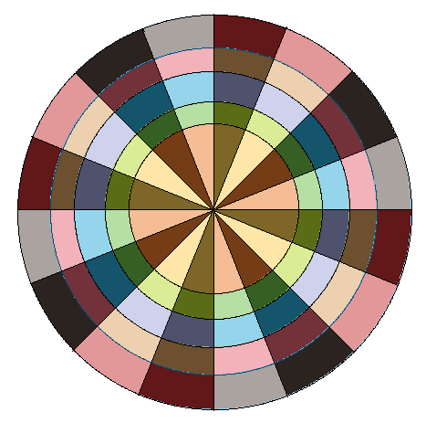
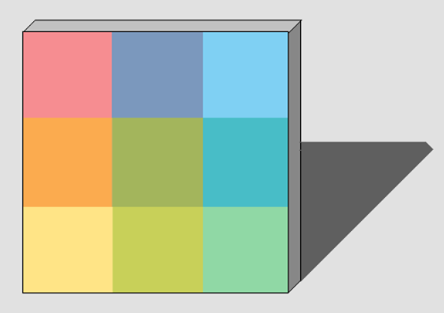
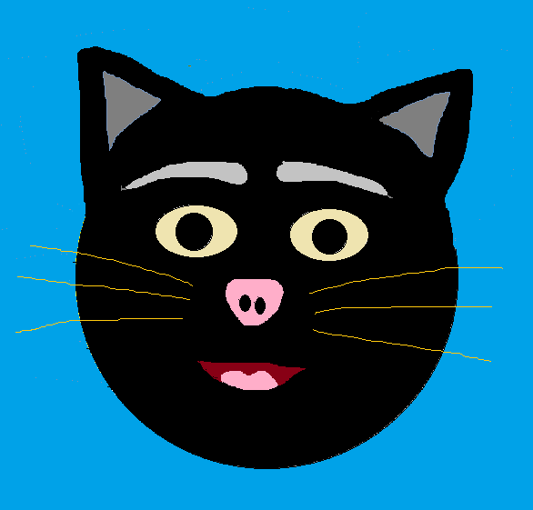

# Paint with C++ and SDL2

- This is a simple drawing tool built using C++ and the SDL2 library

## Some Creations using this application

    
    
    

## Features:
- Drawing primitive shapes like lines, rectangles, ellipses, scribbling shapes
- Simple Tools like Eraser, Bucket fill tool
- Undo-Redo Feature.
- Shape-snapping for lines (to horizontal, vertical and diagonal lines), rectangles (to squares) and ellipses (to circles)
- Colour blending: Transparent fill allows one to achieve alpha blending with the background
- Save image
## Shortcuts:
- `Ctrl + Z/Y` for Undo/Redo
- Hold `Shift` to enable Shape-snapping
- `Ctrl + S` to open save dialogue box

### Notes:
- Currently this application can be compiled using the `make` command on a Windows platform having MinGW installed. This creates the executable `main.exe`.
- This repository also includes a web-version of the application that can be run on a modern browser. The Web-version was generated from the C/C++ code using Emscripten .
- The save image dialogue box functionality has been added using [TinyFileDialogs](https://sourceforge.net/projects/tinyfiledialogs/).
- The image textures/bucketfill.bmp has been taken from the following source:
"https://www.cleanpng.com/png-computer-icons-paint-bucket-tool-paint-house-5198093/".
- All other textures have been created using GIMP.